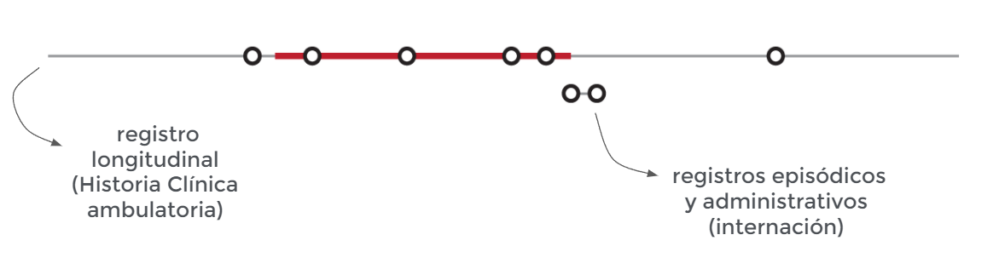

<!-- https://arm.rbind.io/slides/xaringan.html#1 -->
<!-- https://spcanelon.github.io/xaringan-rladies-xalapa/diapositivas/introduccion-xaringan.html#54 -->

# Quienes somos

<!--  -->

---

class: chapter-slide

# Contexto y motivación

---

# Objetivos del Proyecto

<!--  -->

---

# Proyectos impactados

<!--  -->

---

# Ciclo del Dato

<!--  -->
---

# Seguimiento del embarazo y su registro

<!--  -->

---

class: chapter-slide

# Proceso de detección de embarazos

---

## Herramientas

<!--  -->

---

## Embarazos a detectar en un periodo de interés

<!--  -->

---

## Embarazos a detectar en un periodo de interés y ventana de búsqueda

<!--  -->

---

## Registros disponibles en la ventana de búsqueda

<!--  -->

---

## Extracción de información a partir de los registros de una persona

<!--  -->
---

## Agrupación de registros de un mismo embarazo

<!--  -->

---

## Delimitación temporal del embarazo

<!--  -->

---

## Delimitación temporal del embarazo

<!--  -->
---

## Delimitación temporal del embarazo

<!--  -->
---

## Delimitación temporal del embarazo

<!--  -->
---

## Delimitación temporal del embarazo

<!--  -->
---

## Delimitación temporal del embarazo

<!--  -->
---

class: chapter-slide

# Resultados

---

## Caracterización de los embarazos según dimensiones

---

## Muchas gracias!

 
 
 
**Sabrina Laura López** 
sabrinalauralopez@buenosaires.gob.ar  
**Carolina Mengoni Goñalons** 
cmengoni@buenosaires.gob.ar  
**María Cristina Nanton** 
m.nanton@buenosaires.gob.ar  
**Manuel Rodríguez Tablado** 
mrodrigueztablado@buenosaires.gob.ar  

Imágenes: prettycons, shmai, Freepik, rsetiawan, nawicon, mynamepong, Darius Dan, Flat icons en Flaticon.com
